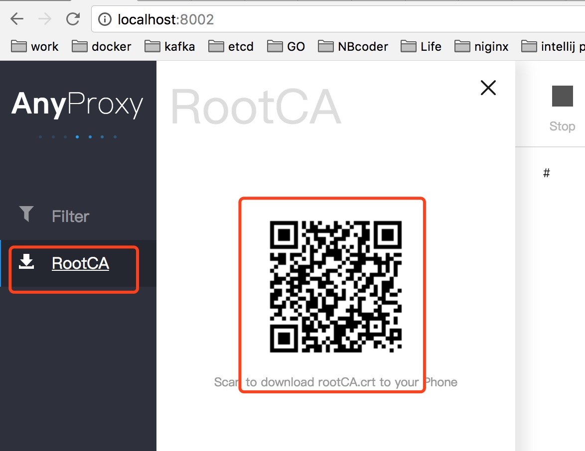
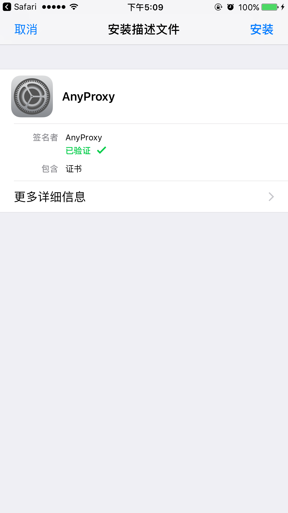
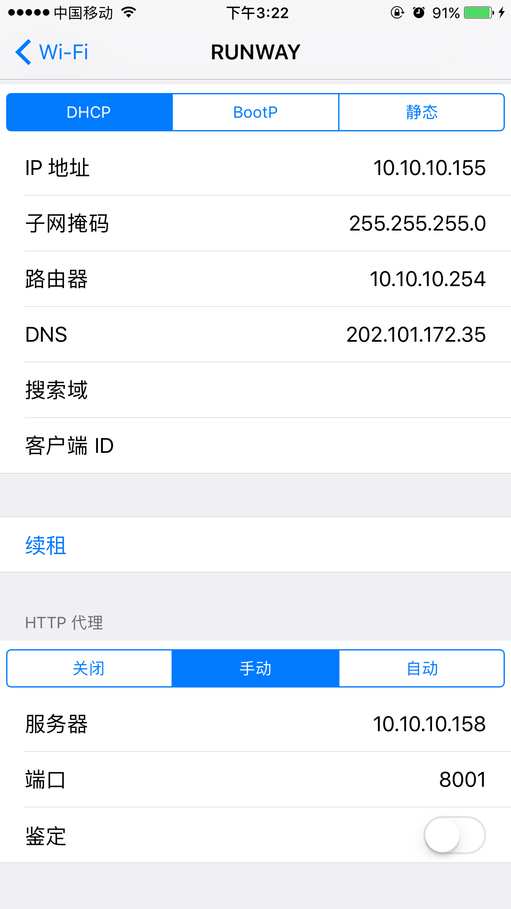
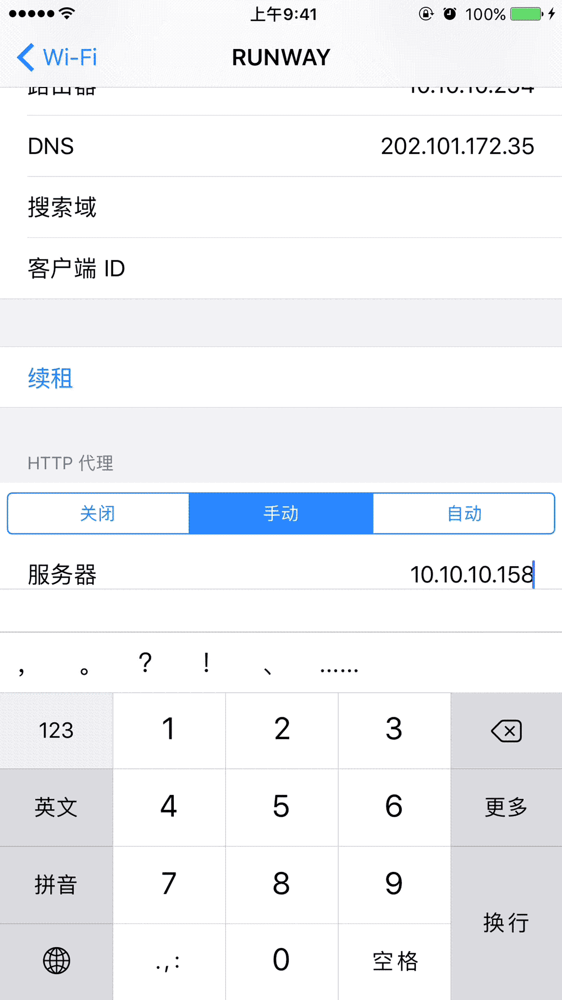
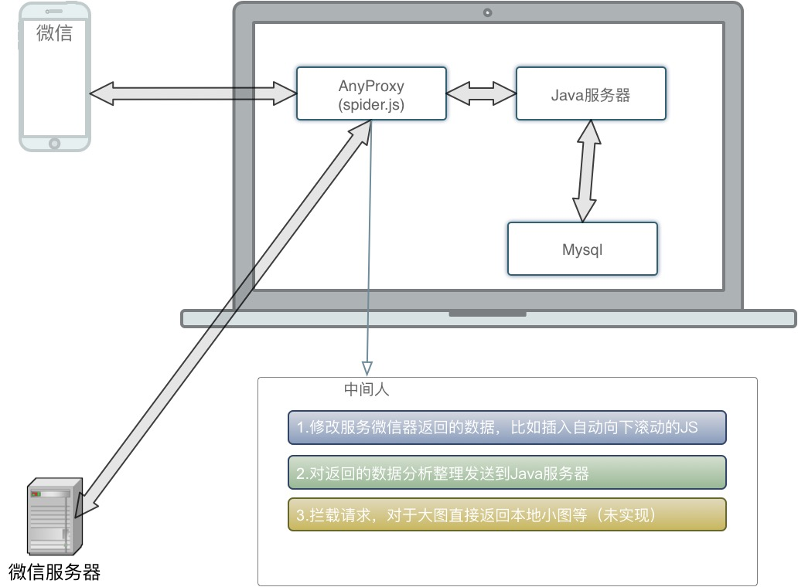

# WechatSpider
抓取微信公众号全部文章，采用AnyProxy+JS+Java实现

# 启动项目
```
// 克隆项目到本地
git clone https://gitee.com/poet/WechatSpider.git

// 修改`WechatSpider/src/main/resources/application.properties`对的数据库地址
vim ~/WechatSpider/src/main/resources/application.properties

// 修改完成后打包
cd ~/WechatSpider && mvn clean install -Dmaven.test.skip=true

// 安装`AnyProxy`
npm install -g anyproxy

// 安装npm插件
cd ~/WechatSpider/src/main/resources && npm install

// 运行`AnyProxy`
anyproxy --intercept --silent true  --rule ~/WechatSpider/src/main/resources/spider.js

// 运行项目
cd ~/WechatSpider
java -jar target/WechatSplider-1.0-SNAPSHOT.jar
```

# 安装AnyProxy的RootCA, 手机扫描安装信任


localhost:8002可以打开RootCA的证书页面

# 代理设置如下图，host填写启动服务的IP地址


同一wifi环境下，手动设置运行jar的服务器：  ip + port(8001)

# 使用
1. 打开微信的公众号，`查看历史信息`自动下拉翻滚抓取所有文章列表数据
2. 文章列表数据抓取完毕后，点击任何一篇文章，打开文章后会抓取文章内容、阅读量、点赞量，评论等数据，10后自动跳转到下一篇文章的抓取，直到抓取完毕



# 功能概述
1. `查看历史消息` 数据全部自动下拉滚动抓取
2. `文章内容`、`点赞量`，`阅读量`，`评论数及内容` 等 已能抓取到，已实现自动跳到下一个文章抓取
3. 优化网络请求，图片请求换成


# 抓取配置
```
// 抓取js
vim ~/WechatSpider/src/main/resources/splider.js

// 规则配置
var config = {
    host: 'http://127.0.0.1:8080', // 服务器地址配置
    crawlHistory: true, // 是否采集列表历史数据
    crawlArticle: true, // 是否采集文章数据
    crawlComment: true, // 是否采集评论数据
    crawlLikeReadNum: true, // 是否采集文章的阅读量及点赞量
    autoNextScroll: true, // 是否自动下拉采取数据
    autoNextPage: true, // 是否自动文章翻页
    autoPostData: true, // 是否提交数据到服务器
    m: 3000, // 自动下拉的时间间隔 m ~ n 秒之间
    n: 5000,
    jumpInterval: 10, // 文章页跳转的时间间隔
    saveContentType: 'html',// 微信文章保存内容的形式: html/text
    localImg: true // 公众号的图片返回本地图片
}
```

# 原理图



# 参考资料

1. http://anyproxy.io/cn
2. https://github.com/lqqyt2423/wechat_spider
3. http://www.cnblogs.com/luojiangwen/p/7943696.html
4. https://gitee.com/zsyoung01/AnyProxy